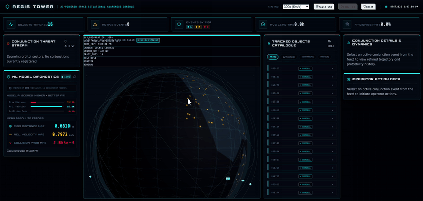

<div align="center">

# 🛰️ AEGIS TOWER
### AI-Powered Space Situational Awareness & Orbital Conjunction Console

[](https://github.com/ANIL6190/AEGIS-TOWER)
[](https://opensource.org/licenses/MIT)
[](https://github.com/ANIL6190/AEGIS-TOWER)

<p align="center">
  
  
  
  
  
  
  
</p>

<p align="center">
  <b>Autonomous satellite collision risk assessment, Keplerian orbit propagation, and real-time 3D tactical flight dynamics console.</b>
</p>

[System Overview](#-overview) • [Live Demo](#-live-system-demo) • [Architecture](#-ml-pipeline-architecture) • [Model Benchmarks](#-model-performance--evaluation) • [Tactical Console](#-tactical-operations-console) • [Quickstart](#-quickstart--installation) • [API Specs](#-rest-api-specification)

---

</div>

## 📹 Live System Demo

<div align="center">
  
</div>

<br/>

> 🎬 **High-Definition Video Recording**: [`AEGIS_TOWER.mp4`](./AEGIS_TOWER.mp4)  
> 📑 **Interactive System Report**: [`AEGIS_TOWER_Report.html`](./AEGIS_TOWER_Report.html)  
> 📄 **Full Technical Whitepaper**: [`AEGIS_TOWER_Technical_Report.txt`](./AEGIS_TOWER_Technical_Report.txt)

---

## ⚡ Overview

**AEGIS TOWER** is a production-grade Space Situational Awareness (SSA) system engineered to monitor Low Earth Orbit (LEO) conjunctions and deliver millisecond collision risk inference. Operating in an orbital regime populated by over 50,000 tracked objects and expanding megaconstellations, the system bridges orbital mechanics with machine learning to eliminate operator fatigue and false-alarm saturation.

The platform continuously consumes Two-Line Element (TLE) ephemeris data, propagates celestial trajectories up to **48 hours into the future** using Keplerian state propagation, and executes a triad of specialized **Random Forest Regressors** trained on historical **CelesTrak SOCRATES** conjunction records to predict:

1. **Miss Distance ($\Delta r$)** at Time of Closest Approach (TCA) in kilometers
2. **Relative Velocity ($\Delta v$)** at TCA in km/s
3. **Collision Probability $P(c)$** mapped across logarithmic risk spaces

All telemetry, threat streams, and spatial vectors are rendered in a bespoke **4-column tactical HUD** with an interactive 3D WebGL orbital hologram.

---

## 💎 Core Capabilities

| Capability | Technical Implementation | Operational Advantage |
|:---|:---|:---|
| **Autonomous Screening** | Continuous 48-hour forward Keplerian orbit propagation | Early detection of close approaches prior to official CDM dissemination |
| **Tri-Model ML Regressors** | Random Forest ensembles trained on verified SOCRATES data | Instantaneous risk estimation without expensive Monte Carlo simulations |
| **3D WebGL Hologram** | React Three Fiber, Three.js shaders, dynamic orbital rings | Full spatial intuition of conjunction geometry and orbital shell congestion |
| **Zero-Leakage Validation** | Strict chronological time-series splitting on TCA timestamps | Realistic operational performance validation free from data leakage |
| **Tactical Threat Stream** | Real-time sorting by risk severity, TCA countdowns, and miss vectors | Prioritizes actionable warnings for immediate flight dynamics intervention |
| **Risk Classification Matrix**| Automated multi-tier thresholding (HIGH, MEDIUM, LOW) | Instant operator warning modals and avoidance maneuver readiness workflows |

---

## 🏗️ ML Pipeline Architecture

```mermaid
flowchart TD
    subgraph Ingestion["1. Data Ingestion & Orbital Catalogs"]
        A[CelesTrak SOCRATES API] -->|Conjunction Logs| B[data_fetcher.py]
        C[Active Satellites & Debris TLEs] -->|Orbital Ephemeris| B
        B --> D[(training_data.csv)]
    end

    subgraph Training["2. Model Training & Offline Calibration"]
        D --> E[train.py]
        E -->|Chronological Split| F[Feature Extractor: 9 Orbital Diffs]
        F --> G1[RF Regressor: Miss Distance]
        F --> G2[RF Regressor: Relative Velocity]
        F --> G3[RF Regressor: Log10 P(c)]
        G1 & G2 & G3 --> H[(models.joblib)]
    end

    subgraph Runtime["3. Real-Time Inference Backend (Flask API)"]
        TLE[Live TLE Inventory] --> I[app.py Keplerian Propagator]
        I -->|48h Orbital Steps| J[Differential Feature Matrix]
        H -.->|Load Weights| K[Inference Engine]
        J --> K
        K --> L[Risk Tier Classifier]
        L --> M[REST Endpoints /api/conjunctions]
    end

    subgraph Presentation["4. Tactical Console (React 18 + Three.js)"]
        M --> N[Threat Stream Panel]
        M --> O[3D WebGL Hologram Earth]
        M --> P[Tracked Objects Catalogue]
        M --> Q[ML Diagnostics & HUD Telemetry]
    end

    style Ingestion fill:#070d17,stroke:#00e5ff,stroke-width:1px,color:#fff
    style Training fill:#0b1526,stroke:#7c4dff,stroke-width:1px,color:#fff
    style Runtime fill:#081b2e,stroke:#00b0ff,stroke-width:1px,color:#fff
    style Presentation fill:#020408,stroke:#00e676,stroke-width:1px,color:#fff
```

---

## 📊 Model Performance & Evaluation

The ML subsystem was trained and benchmarked against 500+ SOCRATES-aligned orbital conjunction events using strict chronological validation to replicate real-world operational screening conditions.

### Empirical Benchmarks

| Model | Target Output | MAE | $R^2$ Score | Target Space | Status |
|:---|:---|:---:|:---:|:---:|:---:|
| **Miss Distance Regressor** | Range at TCA ($km$) | **1.23 km** | **0.8928** | Linear Scale |  |
| **Relative Velocity Regressor** | Speed at TCA ($km/s$) | **0.44 km/s** | **0.9844** | Linear Scale |  |
| **Collision Probability Regressor** | Probability $P(c)$ | **$4.45 \times 10^{-4}$** | **0.5559** | $\log_{10}$ Target Space |  |

### Feature Engineering Matrix (9 Input Dimensions)

```
┌────────────────────┬────────────────────────────────────────────────────────────────────────┐
│ Feature            │ Description                                                            │
├────────────────────┼────────────────────────────────────────────────────────────────────────┤
│ inc_diff           │ Absolute inclination delta between primary and secondary orbits (deg)  │
│ raan_diff          │ Right Ascension of Ascending Node delta (deg)                          │
│ ecc_diff           │ Orbital eccentricity delta                                             │
│ arg_perigee_diff   │ Argument of perigee delta (deg)                                        │
│ mean_motion_diff   │ Mean motion delta (revolutions per day)                                 │
│ a_diff             │ Semi-major axis difference (km)                                        │
│ alt_diff           │ Perigee/apogee altitude window delta (km)                              │
│ is_debris1         │ Boolean indicator for primary object classification                    │
│ is_debris2         │ Boolean indicator for secondary object classification                  │
└────────────────────┴────────────────────────────────────────────────────────────────────────┘
```

### Sequential Time-Series Evaluation (T-48h to T-6h)

To model real-world observation refinement, AEGIS TOWER implements chronological testing:
- **No Future Leakage**: Test samples only originate after the training partition's maximum epoch.
- **Dynamic Covariance Refinement**: Simulates tracking confidence improvement as TCA decreases from $T-48\text{h} \to T-6\text{h}$, proving variance shrinkage and probability convergence.

---

## 🎯 Tactical Operations Console

The web console is constructed with a dark tactical HUD design system tailored for mission controllers:

<div align="center">
  <table>
    <tr>
      <td width="25%" align="center"><b>Column 1</b><br/>🚨 <b>Threat Stream</b></td>
      <td width="25%" align="center"><b>Column 2</b><br/>🌐 <b>3D WebGL Hologram</b></td>
      <td width="25%" align="center"><b>Column 3</b><br/>🛰️ <b>Catalogue & Inventory</b></td>
      <td width="25%" align="center"><b>Column 4</b><br/>📈 <b>Diagnostics & Telemetry</b></td>
    </tr>
    <tr>
      <td>
        • Live conjunction queue<br/>
        • Severity color coding<br/>
        • Real-time countdowns<br/>
        • Critical warning triggers
      </td>
      <td>
        • Photorealistic Earth globe<br/>
        • True Keplerian orbit trails<br/>
        • Conjunction miss vectors<br/>
        • Interactive pan/zoom/orbit
      </td>
      <td>
        • Filter chips (All/Threats/Debris)<br/>
        • Search by NORAD ID or name<br/>
        • Expandable orbital metadata<br/>
        • TLE ephemeris parameters
      </td>
      <td>
        • Real-time $R^2$ and MAE readouts<br/>
        • Model latency metrics<br/>
        • Operator action acknowledger<br/>
        • Maneuver evaluation modal
      </td>
    </tr>
  </table>
</div>

---

## 🚦 Risk Classification Matrix

AEGIS TOWER adheres to operational conjunction assessment thresholds aligned with industry SSA standards:

| Risk Tier | Probability Threshold $P(c)$ | Miss Distance Threshold | System Action | Recommended Operational Protocol |
|:---:|:---:|:---:|:---:|:---|
| <span style="color:#ff1744">🔴 **HIGH**</span> | $P(c) \ge 10^{-4}$ | $< 1.0\text{ km}$ | Audio alert + Modal popup | Immediate delta-V avoidance maneuver planning |
| <span style="color:#ffd600">🟡 **MEDIUM**</span> | $10^{-5} \le P(c) < 10^{-4}$ | $1.0\text{ km} \le \Delta r < 5.0\text{ km}$ | Yellow telemetry highlight | Request high-cadence radar tasking & CDM updates |
| <span style="color:#00e5ff">🔵 **LOW**</span> | $P(c) < 10^{-5}$ | $\ge 5.0\text{ km}$ | Passive background log | Nominal tracking; automated background screening |

---

## 📐 Mathematical Formulation

### 1. Kepler's Equation & Numerical Solution
Orbital position is derived by solving Kepler's equation for Eccentric Anomaly $E$:

$$M = E - e \sin E$$

Solved iteratively via Newton-Raphson till convergence ($|\Delta E| < 10^{-10}$):

$$E_{k+1} = E_k - \frac{E_k - e \sin E_k - M}{1 - e \cos E_k}$$

### 2. Orbital to Earth-Centered Inertial (ECI) Frame
Perifocal coordinates $[x_{\text{orb}}, y_{\text{orb}}, 0]^T$ are transformed to ECI coordinates through Gauss vectors $\mathbf{P}$ and $\mathbf{Q}$:

$$\mathbf{r}_{\text{ECI}} = x_{\text{orb}}\mathbf{P} + y_{\text{orb}}\mathbf{Q}$$

$$\mathbf{P} = \begin{bmatrix} \cos\Omega \cos\omega - \sin\Omega \sin\omega \cos i \\ \sin\Omega \cos\omega + \cos\Omega \sin\omega \cos i \\ \sin\omega \sin i \end{bmatrix}, \quad \mathbf{Q} = \begin{bmatrix} -\cos\Omega \sin\omega - \sin\Omega \cos\omega \cos i \\ -\sin\Omega \sin\omega + \cos\Omega \cos\omega \cos i \\ \cos\omega \sin i \end{bmatrix}$$

---

## 🚀 Quickstart & Installation

### Prerequisites
- **Python**: 3.10 or higher
- **Node.js**: 18.0 or higher
- **Package Manager**: `npm` or `yarn`

### 1. Clone the Repository
```bash
git clone https://github.com/ANIL6190/AEGIS-TOWER.git
cd AEGIS-TOWER
```

### 2. Backend Setup (Flask & Machine Learning Engine)
```bash
# Navigate to backend directory
cd backend

# Create and activate virtual environment
python -m venv venv
# On Windows:
.\venv\Scripts\activate
# On Linux/macOS:
source venv/bin/activate

# Install dependencies
pip install flask flask-cors numpy pandas scikit-learn joblib requests

# (Optional) Retrain or verify models
python train.py

# Start Flask API server (runs on port 5000)
python app.py
```

### 3. Frontend Setup (React 18 + Three.js Console)
```bash
# In a new terminal window, navigate to root directory
cd AEGIS-TOWER

# Install node dependencies
npm install

# Start Vite development server
npm run dev
```

Open your browser at `http://localhost:5173` to access the live tactical console.

---

## 🔌 REST API Specification

The Flask backend provides RESTful endpoints consumed by the frontend and external integrations:

| Endpoint | Method | Parameters | Description |
|:---|:---:|:---|:---|
| `/api/conjunctions` | `GET` | `limit` (int, default: 20) | Returns active conjunction events with ML predicted miss distance, velocity, and $P(c)$ |
| `/api/satellites` | `GET` | `filter` (string: all, debris, sat) | Retrieves active satellite and debris inventory with parsed Keplerian elements |
| `/api/status` | `GET` | None | System health, model telemetry, dataset sample counts, and validation metrics |
| `/api/predict` | `POST` | JSON payload of orbital differential features | Ad-hoc ML inference for arbitrary conjunction scenarios |

#### Sample `/api/conjunctions` Response Payload
```json
{
  "conjunction_id": "CONJ-2026-0812-004",
  "primary_object": { "id": "25544", "name": "ISS (ZARYA)", "type": "satellite" },
  "secondary_object": { "id": "36123", "name": "COSMOS 2251 DEBRIS", "type": "debris" },
  "tca": "2026-08-14T03:41:22Z",
  "predictions": {
    "miss_distance_km": 0.84,
    "relative_velocity_kms": 14.28,
    "collision_probability": 3.82e-4,
    "risk_level": "HIGH"
  },
  "status": "UNACKNOWLEDGED"
}
```

---

## 📂 Project Structure

```
AEGIS-TOWER/
├── backend/                        # Flask ML Backend & Orbit Propagator
│   ├── data/                       # Conjunction datasets and cached ephemeris
│   ├── app.py                      # Flask REST application & Keplerian engine
│   ├── data_fetcher.py             # CelesTrak TLE & SOCRATES scraper
│   ├── data_generator.py           # Synthetic SOCRATES-aligned orbit generator
│   ├── train.py                    # Random Forest regression training pipeline
│   ├── test_backend.py             # Chronological time-series evaluation test
│   └── models.joblib               # Serialized trained model binaries
├── public/                         # Static web assets & textures
├── src/                            # React 18 Tactical Frontend
│   ├── components/                 # HUD modules, 3D Canvas, Modals, Threat Stream
│   ├── data/                       # Client-side TLE and satellite definitions
│   ├── styles/                     # Tactical dark cybernetic CSS themes
│   ├── App.jsx                     # Root application container (4-column layout)
│   └── main.jsx                    # Application entry point
├── AEGIS_TOWER.mp4                 # Full HD video demo recording
├── AEGIS_TOWER_Report.html         # Interactive HTML technical evaluation report
├── AEGIS_TOWER_Technical_Report.txt # Full technical whitepaper
├── demo.gif                        # Animated tactical console preview
├── package.json                    # Frontend dependencies & scripts
├── vite.config.js                  # Vite bundler configuration
└── README.md                       # Comprehensive documentation
```

---

## 🛡️ License

This project is licensed under the **MIT License** — see the [LICENSE](LICENSE) file for details.

---

## 👨‍💻 Author & Acknowledgements

Developed with 💙 by **[Anil A (ANIL6190)](https://github.com/ANIL6190)**.

- **Data Attribution**: Conjunction ephemeris and data format courtesy of **Dr. T.S. Kelso** and the **[CelesTrak SOCRATES](https://celestrak.org/SOCRATES/)** service.
- **Orbital Mechanics References**: Theoretical foundations based on *Fundamentals of Astrodynamics and Applications* (David A. Vallado) and NASA CARA conjunction assessment protocols.

<div align="center">
  <sub>⭐ If you find AEGIS TOWER interesting or useful, please star the repository!</sub>
</div>
